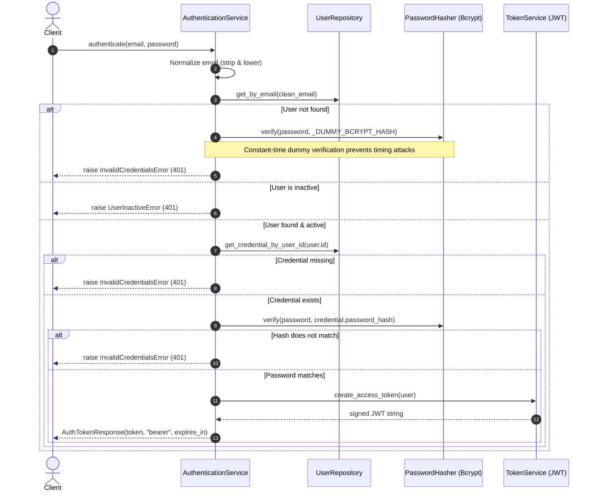

# Walkthrough: M5 Batch 2 — Authentication Infrastructure & Security Services

## Executive Summary

| Attribute | Details |
| :--- | :--- |
| **Phase** | P2 — Project & Repository Platform |
| **Module** | M5 — Identity & Authentication |
| **Batch** | 2 of 3 — Authentication Infrastructure & Security Services |
| **Status** | IMPLEMENTATION COMPLETE & VERIFIED |
| **Test Suite** | 158 passed (127 baseline + 31 new Batch 2 tests) in 8.57s |
| **Quality** | Ruff (pass), Black (105 files compliant), Mypy (74 source files pass) |

Batch 2 establishes the core authentication and cryptographic infrastructure for StackSense. It introduces password hashing, stateless JWT issuance and verification, configuration settings, typed error handling mapped to HTTP 401, and the central `AuthenticationService`.

---

## 1. Architectural Authority & Scope Discipline

### Authority Hierarchy
Following `master.txt` and `AGENTS.md`:
1. Current authoritative architecture in `master.txt`
2. Explicitly approved architectural decisions (Public registration approved for Batch 3; Stateless 60m JWT; Bcrypt with 8–128 character passwords; Project-first hierarchy `User → Project → Repository`)
3. Active module context (`.agents/context/modules/M5-CONTEXT.md`)
4. Frozen M1/M2 predecessor contracts

### Scope Boundaries
```text
┌─────────────────────────────────────────────────────────────┐
│                       M5 SCOPE BOUNDARIES                   │
├──────────────────────────────┬──────────────────────────────┤
│ BATCH 1 (COMPLETED & FROZEN) │ - User domain model          │
│                              │ - UserCredential domain model│
│                              │ - UserRepository contract    │
│                              │ - SqlAlchemyUserRepository   │
│                              │ - UserModel / CredentialModel│
│                              │ - project_access FK RESTRICT │
├──────────────────────────────┼──────────────────────────────┤
│ BATCH 2 (THIS IMPLEMENTATION)│ - PasswordHasher contract    │
│                              │ - BcryptPasswordHasher       │
│                              │ - TokenService contract      │
│                              │ - JwtTokenService            │
│                              │ - TokenPayload domain model  │
│                              │ - AuthenticationService      │
│                              │ - Authentication DTOs        │
│                              │ - Typed Auth Errors (401)    │
│                              │ - Auth Settings (JWT/Bcrypt) │
├──────────────────────────────┼──────────────────────────────┤
│ BATCH 3 (NEXT STEP)          │ - POST /api/v1/auth/login    │
│                              │ - POST /api/v1/auth/register │
│                              │ - GET  /api/v1/auth/me       │
│                              │ - Bearer Token Auth Handler  │
│                              │ - CurrentUserProvider replace│
└──────────────────────────────┴──────────────────────────────┘
```

- **Batch 3 Exclusions Honored:** No HTTP endpoints (`/login`, `/register`, `/me`) were created. The `CurrentUserProvider` / `StaticCurrentUserProvider` test seam was left untouched.
- **Frozen Modules Honored:** M1 and M2 contracts (`Project`, `ProjectAccess`, `ProjectRole`, `ProjectAuthorization`) remain completely unmodified.
- **Tenancy Rules Honored:** Zero `Organization` models, services, or references were introduced.

---

## 2. Authentication Workflow Architecture



---

## 3. Detailed Component Breakdown

### A. Token Domain Primitive
- **File:** [TokenPayload](file:///d:/SystemDesignProject/StackSense/backend/platform/identity/domain/token.py)
- **Role:** Pure frozen domain dataclass representing the validated cryptographic identity claims.
- **Attributes:**
  - `user_id: UUID`
  - `email: str`
  - `token_id: str` (UUID `jti` claim)
  - `issued_at: datetime` (UTC)
  - `expires_at: datetime` (UTC)
- **Design Rationale:** Keeps domain logic and application consumers decoupled from third-party JWT library objects and raw dictionaries.

### B. Password Hashing (`PasswordHasher` & `BcryptPasswordHasher`)
- **Contract:** [PasswordHasher](file:///d:/SystemDesignProject/StackSense/backend/platform/identity/application/password.py)
  - Defines `hash(password: str) -> str`
  - Defines `verify(password: str, password_hash: str) -> bool`
  - Defines `validate(password: str) -> None`
- **Implementation:** [BcryptPasswordHasher](file:///d:/SystemDesignProject/StackSense/backend/platform/identity/infra/password_hasher.py)
  - **Policy Enforcement:** Enforces minimum 8 and maximum 128 characters. Raises typed [PasswordPolicyError](file:///d:/SystemDesignProject/StackSense/backend/platform/errors.py#L161) if outside boundaries.
  - **Bcrypt 72-Byte Buffer Overflow Defense:** `bcrypt.hashpw` in bcrypt 5.0 raises a fatal `ValueError` if input bytes exceed 72. By slicing the encoded UTF-8 bytes to `[:72]` (`password.encode("utf-8")[:72]`), the hasher supports the full 8–128 character policy smoothly while generating 100% standard, interoperable bcrypt hashes.
  - **Exception-Safe Verification:** Catches malformed or forged hash strings inside `verify()`, safely returning `False` without crashing worker processes.
  - **Configurable Work Factor:** Accepts `rounds` parameter (defaults to 12 in production, configurable to 4 in test environments).

### C. Stateless JWT Token Service (`TokenService` & `JwtTokenService`)
- **Contract:** [TokenService](file:///d:/SystemDesignProject/StackSense/backend/platform/identity/application/token.py)
  - Defines `create_access_token(user: User) -> str`
  - Defines `verify_token(token: str) -> TokenPayload`
  - Defines `expiration_seconds: int` property
- **Implementation:** [JwtTokenService](file:///d:/SystemDesignProject/StackSense/backend/platform/identity/infra/token_service.py)
  - **Algorithm:** `HS256`.
  - **RFC 7518 Key Length Security:** Configured with a default development secret key of 64 bytes (> 256 bits), eliminating weak-key warnings and preventing HMAC brute-force attacks.
  - **Standard Claims:** Encodes `sub` (str user ID), `email`, `iat`, `exp` (default 60m), and `jti` (unique UUID per token).
  - **Strict Verification:** `jwt.decode` requires all 5 claims to be present.
  - **Typed Exception Mapping:**
    - `jwt.ExpiredSignatureError` → [TokenExpiredError](file:///d:/SystemDesignProject/StackSense/backend/platform/errors.py#L141)
    - `jwt.PyJWTError` → [InvalidTokenError](file:///d:/SystemDesignProject/StackSense/backend/platform/errors.py#L131)
  - **UUID Invariant Validation:** Verifies that `sub` decodes to a valid UUID; raises `InvalidTokenError` if corrupted.

### D. Typed Authentication Errors & 401 Handler
- **Errors File:** [backend/platform/errors.py](file:///d:/SystemDesignProject/StackSense/backend/platform/errors.py#L108-L177)
  - Added `ErrorCategory.AUTHENTICATION = "authentication"`.
  - Introduced typed errors inheriting from `StackSenseError`:
    - [InvalidCredentialsError](file:///d:/SystemDesignProject/StackSense/backend/platform/errors.py#L108): `code="invalid_credentials"`, `category=AUTHENTICATION`
    - [AuthenticationRequiredError](file:///d:/SystemDesignProject/StackSense/backend/platform/errors.py#L118): `code="authentication_required"`, `category=AUTHENTICATION`
    - [InvalidTokenError](file:///d:/SystemDesignProject/StackSense/backend/platform/errors.py#L131): `code="invalid_token"`, `category=AUTHENTICATION`
    - [TokenExpiredError](file:///d:/SystemDesignProject/StackSense/backend/platform/errors.py#L141): `code="token_expired"`, `category=AUTHENTICATION`
    - [UserInactiveError](file:///d:/SystemDesignProject/StackSense/backend/platform/errors.py#L151): `code="user_inactive"`, `category=AUTHENTICATION`
    - [PasswordPolicyError](file:///d:/SystemDesignProject/StackSense/backend/platform/errors.py#L161): `code="password_policy_violation"`, `category=VALIDATION`
- **Error Handler File:** [backend/api/error_handlers.py](file:///d:/SystemDesignProject/StackSense/backend/api/error_handlers.py#L30-L55)
  - Maps `ErrorCategory.AUTHENTICATION` to HTTP status `401 Unauthorized`.
  - Injects `WWW-Authenticate: Bearer` response header into HTTP 401 responses.
  - Maps `PasswordPolicyError` to HTTP status `422 Unprocessable Entity`.
  - Preserves standard API envelope: `{"error": {"code": ..., "message": ..., "details": ...}}`.

### E. Application DTOs & `AuthenticationService`
- **DTOs File:** [backend/platform/identity/application/dto.py](file:///d:/SystemDesignProject/StackSense/backend/platform/identity/application/dto.py)
  - [LoginRequest](file:///d:/SystemDesignProject/StackSense/backend/platform/identity/application/dto.py#L6-L19): Validates non-empty input and canonicalizes email (`v.strip().lower()`).
  - [AuthTokenResponse](file:///d:/SystemDesignProject/StackSense/backend/platform/identity/application/dto.py#L22-L29): Model with `access_token`, `token_type = "bearer"`, and `expires_in`.
- **Service File:** [backend/platform/identity/application/auth_service.py](file:///d:/SystemDesignProject/StackSense/backend/platform/identity/application/auth_service.py)
  - `authenticate(email: str, password: str) -> AuthTokenResponse`: Orchestrates login.
  - **Account Enumeration Defense:** Uses a pre-computed constant-time bcrypt hash (`_DUMMY_BCRYPT_HASH`) when the user email does not exist, equalizing execution timing between existing and non-existing accounts.
  - `verify_token(token: str) -> TokenPayload`: Validates token signatures.
  - `get_user_from_token(token: str) -> User`: Resolves and validates the database `User` from an active token.

### F. Configuration & Dependency Injection
- **Config File:** [backend/platform/config.py](file:///d:/SystemDesignProject/StackSense/backend/platform/config.py#L16-L20)
  - `jwt_secret_key: SecretStr`
  - `jwt_algorithm: str = "HS256"`
  - `access_token_expire_minutes: int = 60`
  - `bcrypt_rounds: int = 12`
- **Dependencies File:** [backend/platform/identity/application/dependencies.py](file:///d:/SystemDesignProject/StackSense/backend/platform/identity/application/dependencies.py#L35-L68)
  - `get_password_hasher()`: Cached factory yielding `BcryptPasswordHasher`.
  - `get_token_service()`: Cached factory yielding `JwtTokenService`.
  - `get_auth_service(session, hasher, token_service)`: Factory providing `AuthenticationService`.
  - `get_current_user_provider()` / `get_current_user()`: Unchanged to prevent regressions.

---

## 4. Test Matrix & Verification Evidence

### Test Summary
```text
pytest -q
158 passed in 8.57s
```

| Test File | Tests | Focus Area |
| :--- | :--- | :--- |
| [test_password_hasher.py](file:///d:/SystemDesignProject/StackSense/tests/p2/identity/test_password_hasher.py) | 8 | Format check (`$2b$`), verify matching password, reject mismatch, empty/none password rejection, safe handling of malformed hashes, 8-char minimum boundary, 128-char maximum boundary, work factor round configuration. |
| [test_token_service.py](file:///d:/SystemDesignProject/StackSense/tests/p2/identity/test_token_service.py) | 7 | Issue token, verify claims, reject expired token, reject tampered signature, reject token with mismatched secret, reject malformed string, reject non-UUID subject, verify expiration seconds calculation. |
| [test_auth_service.py](file:///d:/SystemDesignProject/StackSense/tests/p2/identity/test_auth_service.py) | 10 | Successful authentication, case and whitespace insensitivity during login, wrong password rejection, nonexistent email rejection with timing defense, inactive user rejection, missing credential rejection, token payload verification, active user resolution from database, deleted user rejection, deactivated user rejection. |
| [test_auth_error_handlers.py](file:///d:/SystemDesignProject/StackSense/tests/p2/identity/test_auth_error_handlers.py) | 6 | `InvalidCredentialsError` (401 + `WWW-Authenticate`), `AuthenticationRequiredError` (401), `InvalidTokenError` (401), `TokenExpiredError` (401), `UserInactiveError` (401), `PasswordPolicyError` (422). |

### Code Quality & Static Analysis
- **Ruff:** `ruff check backend tests` → `All checks passed!`
- **Black:** `black --check backend tests` → `All done! ✨ 🍰 ✨ 105 files would be left unchanged.`
- **Mypy:** `mypy backend` → `Success: no issues found in 74 source files`

---

## 5. Architectural Checklist for Review

- [x] All imports are absolute (`from backend.platform...`).
- [x] Domain layer is pure Python (no SQLAlchemy, FastAPI, or Pydantic imports).
- [x] No plaintext passwords stored, logged, or exposed in domain objects.
- [x] Bcrypt 72-byte buffer overflow handled safely.
- [x] Timing-attack mitigation implemented for non-existent users.
- [x] JWT claims strictly validated with expiration and UUID format checks.
- [x] HTTP 401 exceptions include `WWW-Authenticate: Bearer`.
- [x] Frozen M1/M2 modules and Project RBAC boundaries untouched.
- [x] No speculative Organization concepts introduced.
- [x] Batch 3 endpoints (`/login`, `/register`, `/me`) held until authorized.
